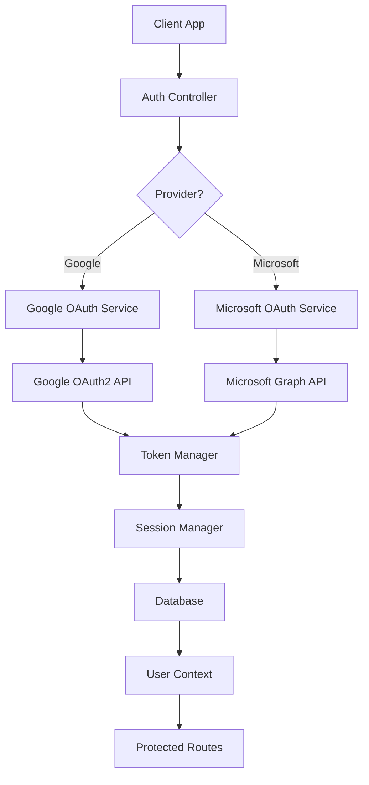
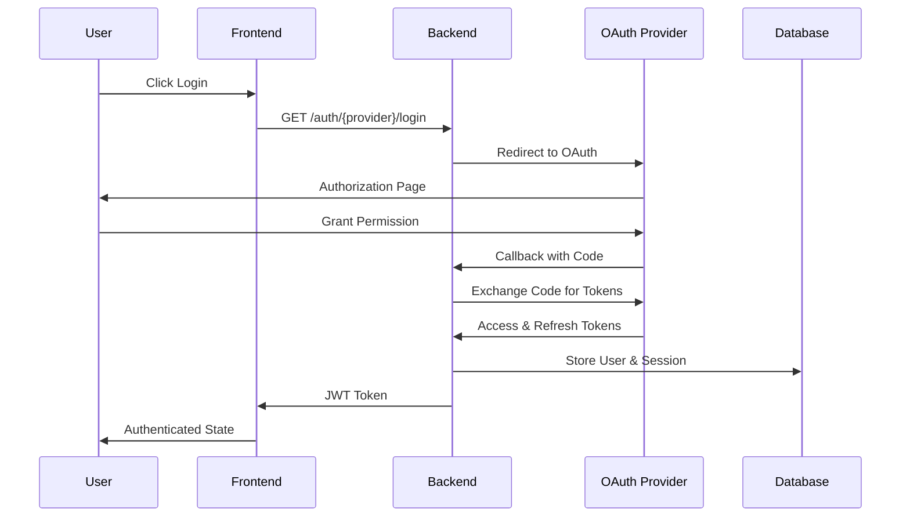

# OAuth2 Authentication Architecture

## Overview

This document outlines the OAuth2 authentication architecture for the Helmsman AI-Augmented Task Management system, supporting both Google and Microsoft authentication providers with secure session management and calendar integration.

## Architecture Components

### 1. Authentication Flow Architecture



### 2. OAuth2 Flow Sequence



## Database Schema Design

### Core Authentication Models

```prisma
model User {
  id          String   @id @default(cuid())
  email       String   @unique
  name        String?
  avatar      String?
  createdAt   DateTime @default(now())
  updatedAt   DateTime @updatedAt

  // OAuth provider information
  providers   OAuthProvider[]
  sessions    UserSession[]

  // Existing relationships preserved
  documents   Document[]
  projects    Project[]
  tasks       Task[]
  // ... other existing relationships

  @@map("users")
}

model OAuthProvider {
  id           String   @id @default(cuid())
  provider     String   // 'google' | 'microsoft'
  providerId   String   // OAuth provider's user ID
  email        String
  accessToken  String?  // Encrypted
  refreshToken String?  // Encrypted
  tokenExpiry  DateTime?
  scopes       String[] // Requested permissions
  createdAt    DateTime @default(now())
  updatedAt    DateTime @updatedAt

  // Relationships
  userId       String
  user         User     @relation(fields: [userId], references: [id], onDelete: Cascade)

  @@unique([provider, providerId])
  @@unique([provider, userId]) // One provider per user
  @@map("oauth_providers")
}

model UserSession {
  id           String   @id @default(cuid())
  sessionId    String   @unique @default(cuid())
  accessToken  String   // JWT for API access
  refreshToken String   // For token rotation
  expiresAt    DateTime
  createdAt    DateTime @default(now())
  updatedAt    DateTime @updatedAt

  // Session metadata
  userAgent    String?
  ipAddress    String?
  isActive     Boolean  @default(true)

  // Relationships
  userId       String
  user         User     @relation(fields: [userId], references: [id], onDelete: Cascade)

  @@map("user_sessions")
}

model BlacklistedToken {
  id        String   @id @default(cuid())
  tokenId   String   @unique // JWT 'jti' claim
  expiresAt DateTime
  createdAt DateTime @default(now())

  @@map("blacklisted_tokens")
}
```

## Security Patterns

### 1. Token Management Strategy

- **JWT Access Tokens**: Short-lived (15 minutes) for API authentication
- **Refresh Tokens**: Long-lived (30 days) with rotation on use
- **OAuth Tokens**: Encrypted at rest, refreshed automatically
- **Token Blacklisting**: Immediate revocation capability

### 2. Session Security

- **Secure HTTP-only cookies** for session management
- **CSRF protection** with double-submit cookie pattern
- **Session timeout** with sliding expiration
- **Concurrent session limits** (max 5 active sessions)

### 3. OAuth Security

- **State parameter validation** to prevent CSRF
- **PKCE (Proof Key for Code Exchange)** for additional security
- **Scope validation** to ensure minimal necessary permissions
- **Token encryption** using AES-256-GCM

## API Endpoint Specifications

### Authentication Endpoints

```typescript
// Authentication initiation
GET /api/auth/{provider}/login
Query: { redirect_uri?: string, state?: string }
Response: 302 Redirect to OAuth provider

// OAuth callback handling
GET /api/auth/{provider}/callback
Query: { code: string, state: string, error?: string }
Response: 302 Redirect to frontend with session

// Session management
POST /api/auth/refresh
Body: { refreshToken: string }
Response: { accessToken: string, refreshToken: string }

POST /api/auth/logout
Headers: { Authorization: Bearer <token> }
Response: { success: boolean }

GET /api/auth/profile
Headers: { Authorization: Bearer <token> }
Response: UserProfile

// Calendar permissions
POST /api/auth/calendar-permissions
Headers: { Authorization: Bearer <token> }
Body: { provider: string, scopes: string[] }
Response: { authUrl: string }
```

### Error Handling

```typescript
interface AuthError {
  code: string;
  message: string;
  details?: any;
}

// Standard error codes
ERROR_CODES = {
  INVALID_PROVIDER: 'auth/invalid-provider',
  OAUTH_FAILED: 'auth/oauth-failed',
  TOKEN_EXPIRED: 'auth/token-expired',
  SESSION_INVALID: 'auth/session-invalid',
  INSUFFICIENT_PERMISSIONS: 'auth/insufficient-permissions',
};
```

## Environment Configuration

### Required Environment Variables

```bash
# JWT Configuration
JWT_SECRET=<strong-secret-key>
JWT_EXPIRES_IN=15m
REFRESH_TOKEN_EXPIRES_IN=30d

# Google OAuth2
GOOGLE_CLIENT_ID=<google-client-id>
GOOGLE_CLIENT_SECRET=<google-client-secret>
GOOGLE_REDIRECT_URI=http://localhost:3000/api/auth/google/callback

# Microsoft OAuth2
MICROSOFT_CLIENT_ID=<microsoft-client-id>
MICROSOFT_CLIENT_SECRET=<microsoft-client-secret>
MICROSOFT_TENANT_ID=<tenant-id-or-common>
MICROSOFT_REDIRECT_URI=http://localhost:3000/api/auth/microsoft/callback

# Encryption
ENCRYPTION_KEY=<32-byte-encryption-key>

# Frontend URLs
FRONTEND_URL=http://localhost:3000
FRONTEND_AUTH_SUCCESS_URL=/dashboard
FRONTEND_AUTH_ERROR_URL=/login?error=auth_failed
```

## Implementation Classes

### 1. AuthService Interface

```typescript
interface IAuthService {
  // OAuth flow management
  initiateOAuth(provider: string, userId?: string): Promise<{ authUrl: string; state: string }>;
  handleCallback(provider: string, code: string, state: string): Promise<AuthResult>;

  // Session management
  createSession(user: User, provider?: string): Promise<SessionTokens>;
  refreshSession(refreshToken: string): Promise<SessionTokens>;
  revokeSession(sessionId: string): Promise<void>;

  // User management
  findOrCreateUser(oauthProfile: OAuthProfile): Promise<User>;
  linkProvider(userId: string, provider: OAuthProvider): Promise<void>;
}
```

### 2. TokenManager

```typescript
interface ITokenManager {
  // JWT operations
  generateAccessToken(payload: JWTPayload): string;
  generateRefreshToken(): string;
  verifyAccessToken(token: string): JWTPayload;

  // OAuth token management
  encryptToken(token: string): string;
  decryptToken(encryptedToken: string): string;

  // Token blacklisting
  blacklistToken(tokenId: string, expiresAt: Date): Promise<void>;
  isTokenBlacklisted(tokenId: string): Promise<boolean>;
}
```

### 3. SessionMiddleware

```typescript
interface ISessionMiddleware {
  // Request authentication
  authenticate(req: Request, res: Response, next: NextFunction): void;
  requireAuth(req: AuthRequest, res: Response, next: NextFunction): void;

  // Permission checking
  requireScopes(scopes: string[]): MiddlewareFunction;
  requireCalendarAccess(): MiddlewareFunction;
}
```

## User Onboarding Flow

### 1. Initial Registration

1. User selects Google or Microsoft login
2. OAuth flow grants basic profile access
3. User profile created with email verification
4. Basic app permissions granted

### 2. Calendar Permission Setup

1. Dashboard prompts for calendar integration
2. Additional OAuth flow for calendar scopes
3. Permission wizard explains calendar benefits
4. Calendar sync enabled with user consent

### 3. Progressive Enhancement

1. Email integration offered after calendar setup
2. Advanced AI features unlocked with more data
3. Collaboration features available post-setup

## Security Audit Checklist

- [ ] OAuth state parameter validation implemented
- [ ] PKCE flow implemented for additional security
- [ ] Tokens encrypted at rest using strong encryption
- [ ] JWT tokens have appropriate expiration times
- [ ] Refresh token rotation implemented
- [ ] Session timeout and cleanup mechanisms
- [ ] CSRF protection with double-submit cookies
- [ ] Rate limiting on authentication endpoints
- [ ] Secure HTTP-only cookies for session management
- [ ] Token blacklisting for immediate revocation
- [ ] Input validation and sanitization
- [ ] Audit logging for authentication events
- [ ] Environment variables properly secured
- [ ] Database connections secured with SSL
- [ ] Regular security dependency updates

## Migration Strategy

### Phase 1: Database Schema Updates

- Add new authentication tables
- Migrate existing users to new schema
- Preserve existing integrations

### Phase 2: Backend Implementation

- Implement OAuth services
- Update existing auth service
- Add session management

### Phase 3: Frontend Integration

- Update auth components
- Add OAuth login buttons
- Implement session handling

### Phase 4: Testing & Deployment

- Comprehensive security testing
- Load testing authentication flows
- Production deployment with monitoring

## Monitoring and Observability

### Key Metrics to Track

- Authentication success/failure rates
- Token refresh frequency
- Session duration patterns
- OAuth provider response times
- Security event frequencies

### Alerting Rules

- High authentication failure rate (>10% for 5 minutes)
- Token refresh failures
- Suspicious login patterns
- OAuth provider outages

This architecture provides a robust, secure foundation for production OAuth2 authentication while maintaining compatibility with existing system components.
