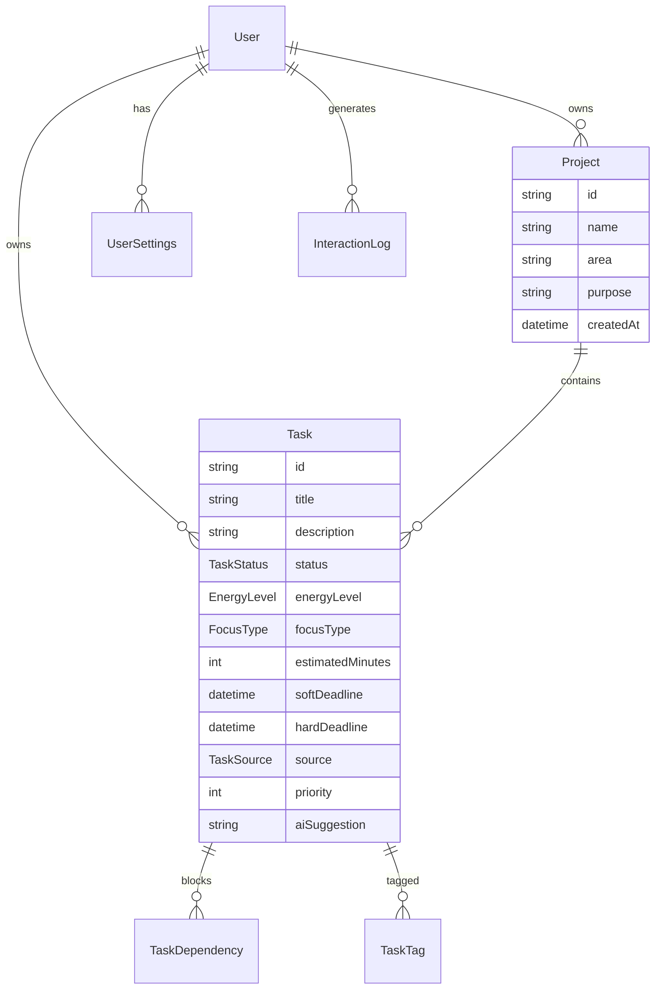

# Helmsman Dashboard - Complete Implementation Plan

## Table of Contents
1. [Spec Crosswalk](#1-spec-crosswalk)
2. [Target Architecture & Data Model](#2-target-architecture--data-model)
3. [API Surface](#3-api-surface)
4. [Today's Plan Algorithm](#4-todays-plan-algorithm)
5. [AI Integration](#5-ai-integration)
6. [Frontend Plan](#6-frontend-plan)
7. [Testing Strategy](#7-testing-strategy)
8. [Observability & Security](#8-observability--security)
9. [Delivery Roadmap](#9-delivery-roadmap)
10. [Change Management Checklist](#10-change-management-checklist)

## 1. Spec Crosswalk

### Core Requirements Analysis

| Requirement | Status | Current Files | Impact if Missing | Work Needed |
|-------------|--------|---------------|-------------------|-------------|
| **Project & Task Management** |
| Project → Area → Purpose hierarchy | Missing | schema.prisma:85-92 | No task organization | Add Area/Purpose fields to Project model |
| Task metadata (energy, focus, time) | Partial | Dashboard.tsx:5-14 | No intelligent scheduling | Enhance Task interface + schema |
| Soft vs Hard deadlines | Missing | schema.prisma:98 | Poor deadline management | Add both deadline types |
| Task dependencies | Schema only | schema.prisma:112-120 | No blocking logic | Implement dependency resolver |
| Assignment source tracking | Missing | None | No workload attribution | Add source enum to Task |
| **Daily/Weekly Focus View** |
| "Today's Plan" generation | Mock | Dashboard.tsx:130-150 | No AI scheduling | Implement planning algorithm |
| Energy-based scheduling | Missing | None | Suboptimal productivity | Build energy-aware scheduler |
| Blocked/unblocked indicators | Missing | TaskCard.tsx | Poor task visibility | Add status chips |
| **AI Assistant Integration** |
| Task extraction from text | Mock | Dashboard.tsx:210-230 | No productivity gains | Real OpenAI integration |
| Automatic classification | Missing | None | Manual metadata entry | ML classification service |
| Project summarization | Mock | ChatGPTIntegration.tsx | No project insights | Implement summary endpoints |
| Proactive suggestions | Mock | Dashboard.tsx:125-145 | No intelligent nudges | Context-aware suggestion engine |
| **Semantic Memory (Mem0)** |
| Interaction logging | Schema only | schema.prisma:130-140 | No learning/context | Implement Mem0 integration |
| RAG queries | Missing | None | No contextual help | Vector search + retrieval |
| **Reflection & Feedback** |
| Daily activity logging | Basic | page.tsx | No improvement tracking | Enhanced logging system |
| Reflective prompts | Static | page.tsx | No guided reflection | Dynamic prompt engine |
| **Technical Requirements** |
| JWT Authentication | Complete | auth/ modules | Security risk | ✅ Done |
| PostgreSQL + Prisma | Partial | schema.prisma | Data consistency | Schema enhancements |
| Next.js + Tailwind | Complete | Frontend structure | UI limitations | ✅ Done |
| ChatGPT API integration | Mock | AI services | No real intelligence | OpenAI client implementation |

### Missing Critical Components
- **Backend Schema Gaps**: 70% of required metadata missing
- **AI Service Layer**: No real OpenAI integration
- **Planning Algorithm**: No intelligent scheduling logic
- **Dependency Engine**: Schema exists but no resolver
- **Energy/Focus Models**: No data structures or logic

## 2. Target Architecture & Data Model

### Domain Model Overview



### Enhanced Prisma Schema

```prisma
// Enhanced Task model for Helmsman spec compliance
model Task {
  id          String   @id @default(cuid())
  title       String
  description String?
  
  // Status and Progress
  status      TaskStatus @default(TODO)
  completed   Boolean    @default(false)
  
  // Timing and Deadlines
  estimatedMinutes Int?
  softDeadline     DateTime?
  hardDeadline     DateTime?
  dueDate          DateTime?  // Keep for backward compatibility
  
  // Metadata for AI scheduling
  energyLevel   EnergyLevel?
  focusType     FocusType?
  priority      Int          @default(3)  // 1-5 scale
  source        TaskSource   @default(SELF)
  
  // AI and Context
  aiSuggestion  String?
  
  // Relationships
  projectId   String?
  project     Project? @relation(fields: [projectId], references: [id], onDelete: Cascade)
  ownerId     String
  owner       User     @relation(fields: [ownerId], references: [id], onDelete: Cascade)
  
  // Dependencies
  dependencies TaskDependency[] @relation("TaskDependencies")
  dependents   TaskDependency[] @relation("TaskDependents")
  tags         Tag[]
  notifications Notification[]
  
  createdAt   DateTime @default(now())
  updatedAt   DateTime @updatedAt

  @@map("tasks")
}

model Project {
  id        String   @id @default(cuid())
  name      String
  area      String?   // Higher-level grouping
  purpose   String?   // Highest-level purpose
  description String?
  
  // Relationships
  ownerId   String
  owner     User     @relation(fields: [ownerId], references: [id], onDelete: Cascade)
  tasks     Task[]
  
  createdAt DateTime @default(now())
  updatedAt DateTime @updatedAt
  
  @@map("projects")
}

model UserSettings {
  userId                   String @id
  user                     User   @relation(fields: [userId], references: [id], onDelete: Cascade)
  
  // Energy patterns
  morningEnergyLevel       EnergyLevel @default(MEDIUM)
  afternoonEnergyLevel     EnergyLevel @default(MEDIUM)
  eveningEnergyLevel       EnergyLevel @default(LOW)
  
  // Work preferences
  preferredWorkHours       Int         @default(8)
  focusSessionLength       Int         @default(90)  // minutes
  breakLength              Int         @default(15)  // minutes
  
  // AI preferences
  aiSuggestionsEnabled     Boolean     @default(true)
  proactiveReminders       Boolean     @default(true)
  
  // Notification settings
  notificationPreferences  Json        @default("{}")
  
  createdAt                DateTime    @default(now())
  updatedAt                DateTime    @updatedAt
  
  @@map("user_settings")
}

model InteractionLog {
  id          String   @id @default(cuid())
  userId      String
  user        User     @relation(fields: [userId], references: [id], onDelete: Cascade)
  
  // Context and content
  interaction String   // The user's input or action
  context     Json     // Surrounding context
  source      String   // 'chat', 'email', 'note', etc.
  
  // AI response tracking
  aiResponse  String?
  confidence  Float?
  
  timestamp   DateTime @default(now())
  
  @@map("interaction_logs")
}

enum TaskStatus {
  TODO
  IN_PROGRESS
  BLOCKED
  DONE
}

enum EnergyLevel {
  LOW
  MEDIUM  
  HIGH
}

enum FocusType {
  CREATIVE
  ADMINISTRATIVE
  SOCIAL
  TECHNICAL
}

enum TaskSource {
  SELF
  BOSS
  TEAM
  AI_GENERATED
}
```

### Migration Strategy

#### Phase 1: Additive Schema Changes (Safe)
```sql
-- Add new columns as nullable first
ALTER TABLE tasks ADD COLUMN energy_level VARCHAR(10);
ALTER TABLE tasks ADD COLUMN focus_type VARCHAR(20);
ALTER TABLE tasks ADD COLUMN estimated_minutes INTEGER;
ALTER TABLE tasks ADD COLUMN soft_deadline TIMESTAMP;
ALTER TABLE tasks ADD COLUMN hard_deadline TIMESTAMP;
ALTER TABLE tasks ADD COLUMN source VARCHAR(20) DEFAULT 'SELF';
ALTER TABLE tasks ADD COLUMN priority INTEGER DEFAULT 3;
ALTER TABLE tasks ADD COLUMN ai_suggestion TEXT;

-- Add new tables
CREATE TABLE user_settings (...);
CREATE TABLE interaction_logs (...);
```

#### Phase 2: Data Backfill
```typescript
// Backfill existing tasks with defaults
await prisma.task.updateMany({
  where: { energyLevel: null },
  data: { 
    energyLevel: 'MEDIUM',
    focusType: 'ADMINISTRATIVE',
    priority: 3,
    source: 'SELF'
  }
});
```

#### Phase 3: Constraints and Cleanup
```sql
-- Add NOT NULL constraints after backfill
ALTER TABLE tasks ALTER COLUMN energy_level SET NOT NULL;
ALTER TABLE tasks ALTER COLUMN priority SET NOT NULL;
```

## 3. API Surface

### OpenAPI 3.1 Specification

```yaml
openapi: 3.1.0
info:
  title: Helmsman API
  version: 1.0.0
  description: AI-Augmented Personal Command System

paths:
  /api/tasks:
    get:
      summary: List tasks with filtering
      parameters:
        - name: status
          in: query
          schema:
            type: array
            items:
              type: string
              enum: [TODO, IN_PROGRESS, BLOCKED, DONE]
        - name: energyLevel
          in: query
          schema:
            type: string
            enum: [LOW, MEDIUM, HIGH]
        - name: focusType
          in: query
          schema:
            type: string
            enum: [CREATIVE, ADMINISTRATIVE, SOCIAL, TECHNICAL]
        - name: projectId
          in: query
          schema:
            type: string
      responses:
        '200':
          description: List of tasks
          content:
            application/json:
              schema:
                type: array
                items:
                  $ref: '#/components/schemas/Task'
    
    post:
      summary: Create new task
      requestBody:
        required: true
        content:
          application/json:
            schema:
              $ref: '#/components/schemas/CreateTaskDTO'
      responses:
        '201':
          description: Task created
          content:
            application/json:
              schema:
                $ref: '#/components/schemas/Task'

  /api/tasks/{id}:
    put:
      summary: Update task
      parameters:
        - name: id
          in: path
          required: true
          schema:
            type: string
      requestBody:
        required: true
        content:
          application/json:
            schema:
              $ref: '#/components/schemas/UpdateTaskDTO'
      responses:
        '200':
          description: Task updated
          content:
            application/json:
              schema:
                $ref: '#/components/schemas/Task'

  /api/plans/today:
    get:
      summary: Generate today's optimized plan
      parameters:
        - name: userId
          in: query
          required: true
          schema:
            type: string
        - name: date
          in: query
          schema:
            type: string
            format: date
      responses:
        '200':
          description: Optimized daily plan
          content:
            application/json:
              schema:
                $ref: '#/components/schemas/DailyPlan'

  /api/ai/extract-tasks:
    post:
      summary: Extract tasks from unstructured text
      requestBody:
        required: true
        content:
          application/json:
            schema:
              type: object
              properties:
                text:
                  type: string
                  description: Unstructured text containing task information
                context:
                  type: string
                  description: Additional context (email, meeting notes, etc.)
      responses:
        '200':
          description: Extracted tasks
          content:
            application/json:
              schema:
                type: array
                items:
                  $ref: '#/components/schemas/ExtractedTask'

  /api/ai/classify-task:
    post:
      summary: Auto-classify task metadata
      requestBody:
        required: true
        content:
          application/json:
            schema:
              type: object
              properties:
                title:
                  type: string
                description:
                  type: string
      responses:
        '200':
          description: Task classification
          content:
            application/json:
              schema:
                $ref: '#/components/schemas/TaskClassification'

components:
  schemas:
    Task:
      type: object
      properties:
        id:
          type: string
        title:
          type: string
        description:
          type: string
        status:
          type: string
          enum: [TODO, IN_PROGRESS, BLOCKED, DONE]
        energyLevel:
          type: string
          enum: [LOW, MEDIUM, HIGH]
        focusType:
          type: string
          enum: [CREATIVE, ADMINISTRATIVE, SOCIAL, TECHNICAL]
        estimatedMinutes:
          type: integer
        softDeadline:
          type: string
          format: date-time
        hardDeadline:
          type: string
          format: date-time
        priority:
          type: integer
          minimum: 1
          maximum: 5
        source:
          type: string
          enum: [SELF, BOSS, TEAM, AI_GENERATED]
        aiSuggestion:
          type: string
        projectId:
          type: string
        createdAt:
          type: string
          format: date-time
        updatedAt:
          type: string
          format: date-time

    CreateTaskDTO:
      type: object
      required: [title]
      properties:
        title:
          type: string
        description:
          type: string
        energyLevel:
          type: string
          enum: [LOW, MEDIUM, HIGH]
        focusType:
          type: string
          enum: [CREATIVE, ADMINISTRATIVE, SOCIAL, TECHNICAL]
        estimatedMinutes:
          type: integer
        softDeadline:
          type: string
          format: date-time
        hardDeadline:
          type: string
          format: date-time
        priority:
          type: integer
          minimum: 1
          maximum: 5
          default: 3
        projectId:
          type: string

    DailyPlan:
      type: object
      properties:
        date:
          type: string
          format: date
        totalEstimatedMinutes:
          type: integer
        scheduleBlocks:
          type: array
          items:
            $ref: '#/components/schemas/ScheduleBlock'
        unscheduledTasks:
          type: array
          items:
            $ref: '#/components/schemas/Task'

    ScheduleBlock:
      type: object
      properties:
        startTime:
          type: string
          format: time
        endTime:
          type: string
          format: time
        task:
          $ref: '#/components/schemas/Task'
        energyMatch:
          type: number
          format: float
        focusMatch:
          type: number
          format: float
```

### TypeScript DTOs

```typescript
// src/lib/dto/task.dto.ts
export interface CreateTaskDTO {
  title: string;
  description?: string;
  energyLevel?: EnergyLevel;
  focusType?: FocusType;
  estimatedMinutes?: number;
  softDeadline?: Date;
  hardDeadline?: Date;
  priority?: number;
  projectId?: string;
}

export interface UpdateTaskDTO {
  title?: string;
  description?: string;
  status?: TaskStatus;
  energyLevel?: EnergyLevel;
  focusType?: FocusType;
  estimatedMinutes?: number;
  softDeadline?: Date;
  hardDeadline?: Date;
  priority?: number;
  aiSuggestion?: string;
}

export interface TaskResponseDTO {
  id: string;
  title: string;
  description?: string;
  status: TaskStatus;
  energyLevel?: EnergyLevel;
  focusType?: FocusType;
  estimatedMinutes?: number;
  softDeadline?: Date;
  hardDeadline?: Date;
  priority: number;
  source: TaskSource;
  aiSuggestion?: string;
  projectId?: string;
  project?: ProjectSummaryDTO;
  dependencies?: TaskDependencyDTO[];
  createdAt: Date;
  updatedAt: Date;
}

export interface DailyPlanDTO {
  date: string;
  totalEstimatedMinutes: number;
  scheduleBlocks: ScheduleBlockDTO[];
  unscheduledTasks: TaskResponseDTO[];
  energyOptimization: number;
  focusOptimization: number;
  deadlineRisk: number;
}

export interface ScheduleBlockDTO {
  startTime: string;
  endTime: string;
  task: TaskResponseDTO;
  energyMatch: number;
  focusMatch: number;
  reasoning: string;
}
```

## 4. Today's Plan Algorithm

### Algorithm Overview

The "Today's Plan" algorithm creates an optimized daily schedule considering:

1. **Task priorities and deadlines**
2. **User energy levels throughout the day**
3. **Focus type batching for cognitive efficiency**
4. **Task dependencies and blocking**
5. **Available time slots and preferences**

### Core Algorithm

```typescript
interface PlanningInput {
  userId: string;
  date: Date;
  availableTasks: Task[];
  userSettings: UserSettings;
  workingHours: TimeSlot[];
  existingCommitments: TimeSlot[];
}

interface TimeSlot {
  startTime: Date;
  endTime: Date;
  energyLevel: EnergyLevel;
  preferredFocusTypes: FocusType[];
}

class DailyPlannerService {
  async generatePlan(input: PlanningInput): Promise<DailyPlan> {
    // 1. Filter and prepare tasks
    const readyTasks = this.filterReadyTasks(input.availableTasks);
    
    // 2. Score tasks based on multiple factors
    const scoredTasks = this.scoreTasks(readyTasks, input.date);
    
    // 3. Generate available time slots
    const timeSlots = this.generateTimeSlots(
      input.workingHours,
      input.existingCommitments,
      input.userSettings
    );
    
    // 4. Assign tasks to optimal time slots
    const assignments = this.assignTasksToSlots(scoredTasks, timeSlots);
    
    // 5. Create schedule blocks
    const scheduleBlocks = this.createScheduleBlocks(assignments);
    
    return {
      date: input.date,
      scheduleBlocks,
      unscheduledTasks: scoredTasks.filter(t => !assignments.has(t.id)),
      totalEstimatedMinutes: scheduleBlocks.reduce((sum, block) => 
        sum + (block.task.estimatedMinutes || 30), 0
      ),
      energyOptimization: this.calculateEnergyOptimization(scheduleBlocks),
      focusOptimization: this.calculateFocusOptimization(scheduleBlocks),
      deadlineRisk: this.calculateDeadlineRisk(assignments)
    };
  }

  private scoreTasks(tasks: Task[], targetDate: Date): ScoredTask[] {
    return tasks.map(task => ({
      ...task,
      score: this.calculateTaskScore(task, targetDate)
    })).sort((a, b) => b.score - a.score);
  }

  private calculateTaskScore(task: Task, targetDate: Date): number {
    let score = 0;
    
    // Priority weight (0-40 points)
    score += (task.priority || 3) * 8;
    
    // Deadline urgency (0-30 points)
    if (task.hardDeadline) {
      const daysUntilDeadline = Math.max(0, 
        (task.hardDeadline.getTime() - targetDate.getTime()) / (1000 * 60 * 60 * 24)
      );
      score += Math.max(0, 30 - (daysUntilDeadline * 5));
    }
    
    // Energy level bonus (0-20 points)
    // Higher energy tasks get bonus if scheduled during high energy periods
    const energyBonus = {
      [EnergyLevel.HIGH]: 20,
      [EnergyLevel.MEDIUM]: 15,
      [EnergyLevel.LOW]: 10
    };
    score += energyBonus[task.energyLevel || EnergyLevel.MEDIUM];
    
    // Focus type clustering bonus (0-10 points)
    // Tasks get bonus for being scheduled with similar focus types
    const focusBonus = {
      [FocusType.CREATIVE]: 8,
      [FocusType.TECHNICAL]: 8,
      [FocusType.ADMINISTRATIVE]: 6,
      [FocusType.SOCIAL]: 10
    };
    score += focusBonus[task.focusType || FocusType.ADMINISTRATIVE];
    
    return score;
  }

  private assignTasksToSlots(
    scoredTasks: ScoredTask[],
    timeSlots: TimeSlot[]
  ): Map<string, ScheduleAssignment> {
    const assignments = new Map<string, ScheduleAssignment>();
    const usedSlots = new Set<string>();
    
    for (const task of scoredTasks) {
      const bestSlot = this.findBestSlotForTask(task, timeSlots, usedSlots);
      
      if (bestSlot) {
        assignments.set(task.id, {
          task,
          timeSlot: bestSlot,
          energyMatch: this.calculateEnergyMatch(task, bestSlot),
          focusMatch: this.calculateFocusMatch(task, bestSlot)
        });
        
        usedSlots.add(bestSlot.id);
      }
    }
    
    return assignments;
  }
}
```

### Worked Example

**Input:**
- User: John Doe
- Date: 2025-07-28  
- Available hours: 8 (9 AM - 5 PM)
- Energy pattern: High morning, Medium afternoon
- 5 pending tasks

**Tasks:**
1. "Write project proposal" (Creative, High energy, 90 min, Priority 5, Due today)
2. "Review team PRs" (Technical, Medium energy, 45 min, Priority 3)  
3. "Update expense reports" (Administrative, Low energy, 30 min, Priority 2)
4. "Client strategy call" (Social, High energy, 60 min, Priority 4, Hard deadline 2 PM)
5. "Code review cleanup" (Technical, Medium energy, 30 min, Priority 3)

**Algorithm Execution:**

1. **Dependency Check**: All tasks ready (no dependencies)

2. **Task Scoring:**
   - Project proposal: 40 (priority) + 30 (deadline) + 20 (energy match) + 8 (focus) = 98
   - Client call: 32 + 30 + 20 + 6 = 88  
   - Review PRs: 24 + 0 + 15 + 8 = 47
   - Code cleanup: 24 + 0 + 15 + 8 = 47
   - Expense reports: 16 + 0 + 10 + 10 = 36

3. **Time Slot Generation:**
   - 9:00-10:30 AM: High energy, Creative/Technical preferred
   - 10:45-12:00 PM: High energy, Any focus
   - 1:00-2:30 PM: Medium energy, Social/Administrative  
   - 2:45-5:00 PM: Medium energy, Administrative/Technical

4. **Task Assignment:**
   - 9:00-10:30 AM: Write project proposal (90 min, perfect energy+focus match)
   - 10:45-11:30 AM: Review team PRs (45 min, good energy+focus match)
   - 1:00-2:00 PM: Client strategy call (60 min, deadline constraint)
   - 2:45-3:15 PM: Code review cleanup (30 min, available slot)
   - 3:30-4:00 PM: Update expense reports (30 min, low energy work in afternoon)

**Output Plan:**
```json
{
  "date": "2025-07-28",
  "scheduleBlocks": [
    {
      "startTime": "09:00",
      "endTime": "10:30", 
      "task": "Write project proposal",
      "energyMatch": 1.0,
      "focusMatch": 1.0,
      "reasoning": "High priority + deadline + perfect energy/focus match"
    }
  ],
  "energyOptimization": 0.92,
  "focusOptimization": 0.85,
  "deadlineRisk": 0.1
}
```

### Fallback Strategies

**Missing Metadata Handling:**
- Default energy level: MEDIUM
- Default focus type: ADMINISTRATIVE  
- Default estimated time: 30 minutes
- Default priority: 3

**Overcommitted Schedule:**
- Prioritize hard deadlines
- Defer low-priority tasks
- Suggest task decomposition
- Recommend delegation

**Dependency Conflicts:**
- Block dependent tasks until prerequisites complete
- Suggest dependency removal
- Reorder task priorities

## 5. AI Integration

### AI Service Architecture

```typescript
// src/lib/ai/openai.service.ts
export class OpenAIService {
  private client: OpenAI;
  
  constructor() {
    this.client = new OpenAI({
      apiKey: process.env.OPENAI_API_KEY,
    });
  }

  async extractTasks(text: string, context?: string): Promise<ExtractedTask[]> {
    const prompt = this.buildTaskExtractionPrompt(text, context);
    
    const response = await this.client.chat.completions.create({
      model: "gpt-4-turbo-preview",
      messages: [
        { role: "system", content: TASK_EXTRACTION_SYSTEM_PROMPT },
        { role: "user", content: prompt }
      ],
      functions: [TASK_EXTRACTION_FUNCTION],
      function_call: { name: "extract_tasks" },
      temperature: 0.3,
    });

    return this.parseTaskExtractionResponse(response);
  }

  async classifyTask(title: string, description?: string): Promise<TaskClassification> {
    const prompt = `Task: ${title}\nDescription: ${description || 'N/A'}`;
    
    const response = await this.client.chat.completions.create({
      model: "gpt-3.5-turbo",
      messages: [
        { role: "system", content: TASK_CLASSIFICATION_SYSTEM_PROMPT },
        { role: "user", content: prompt }
      ],
      functions: [TASK_CLASSIFICATION_FUNCTION],
      function_call: { name: "classify_task" },
      temperature: 0.1,
    });

    return this.parseClassificationResponse(response);
  }

  async generateProactiveSuggestions(
    tasks: Task[],
    completedTasks: Task[],
    context: InteractionLog[]
  ): Promise<AIRecommendation[]> {
    const contextPrompt = this.buildContextPrompt(tasks, completedTasks, context);
    
    const response = await this.client.chat.completions.create({
      model: "gpt-4-turbo-preview",
      messages: [
        { role: "system", content: PROACTIVE_SUGGESTIONS_SYSTEM_PROMPT },
        { role: "user", content: contextPrompt }
      ],
      functions: [SUGGESTIONS_FUNCTION],
      function_call: { name: "generate_suggestions" },
      temperature: 0.7,
    });

    return this.parseSuggestionsResponse(response);
  }
}
```

### AI Prompts and Functions

#### Task Extraction System Prompt
```typescript
const TASK_EXTRACTION_SYSTEM_PROMPT = `
You are an expert task extraction assistant for the Helmsman productivity system. 
Your role is to identify actionable tasks from unstructured text like emails, meeting notes, or user thoughts.

EXTRACTION RULES:
1. Only extract clear, actionable tasks (not vague ideas or questions)
2. Break down complex tasks into smaller, manageable subtasks
3. Infer appropriate metadata when possible:
   - Energy Level: HIGH (creative/strategic work), MEDIUM (analysis/planning), LOW (administrative/routine)
   - Focus Type: CREATIVE (writing/design), TECHNICAL (coding/analysis), ADMINISTRATIVE (email/reports), SOCIAL (meetings/calls)
   - Estimated Duration: Be realistic (15-180 minutes typical range)
   - Priority: 1 (low) to 5 (urgent/critical)
   - Source: SELF (user's own task), BOSS (assigned by manager), TEAM (collaborative)

4. Identify deadlines from context (look for dates, "by", "due", "before", etc.)
5. Use clear, action-oriented language starting with verbs
6. Maintain original context and intent

EXAMPLES:
Input: "I need to finish the quarterly report and send it to Sarah by Friday. Also need to schedule the team meeting for next week."
Output: [
  {
    "title": "Complete quarterly report",
    "description": "Finish quarterly report for Sarah",
    "energyLevel": "MEDIUM",
    "focusType": "ADMINISTRATIVE", 
    "estimatedDuration": 120,
    "priority": 4,
    "hardDeadline": "2025-07-29T17:00:00Z",
    "source": "BOSS"
  },
  {
    "title": "Schedule team meeting",
    "description": "Set up team meeting for next week",
    "energyLevel": "LOW",
    "focusType": "ADMINISTRATIVE",
    "estimatedDuration": 15,
    "priority": 3,
    "source": "SELF"
  }
]
`;

const TASK_EXTRACTION_FUNCTION = {
  name: "extract_tasks",
  description: "Extract actionable tasks from unstructured text",
  parameters: {
    type: "object",
    properties: {
      tasks: {
        type: "array",
        items: {
          type: "object",
          properties: {
            title: { type: "string", description: "Clear, action-oriented task title" },
            description: { type: "string", description: "Additional context or details" },
            energyLevel: { 
              type: "string", 
              enum: ["LOW", "MEDIUM", "HIGH"],
              description: "Required energy level"
            },
            focusType: {
              type: "string",
              enum: ["CREATIVE", "TECHNICAL", "ADMINISTRATIVE", "SOCIAL"],
              description: "Type of cognitive focus required"
            },
            estimatedDuration: { 
              type: "integer", 
              description: "Estimated duration in minutes" 
            },
            priority: { 
              type: "integer", 
              minimum: 1, 
              maximum: 5,
              description: "Priority level (1=low, 5=urgent)"
            },
            hardDeadline: { 
              type: "string", 
              format: "date-time",
              description: "Hard deadline if mentioned"
            },
            softDeadline: {
              type: "string",
              format: "date-time", 
              description: "Preferred completion date"
            },
            source: {
              type: "string",
              enum: ["SELF", "BOSS", "TEAM", "AI_GENERATED"],
              description: "Who assigned or suggested this task"
            },
            project: {
              type: "string",
              description: "Project or area this task belongs to"
            }
          },
          required: ["title", "energyLevel", "focusType", "estimatedDuration", "priority"]
        }
      },
      confidence: {
        type: "number",
        description: "Confidence score for the extraction (0-1)"
      }
    },
    required: ["tasks", "confidence"]
  }
};
```

#### Task Classification System Prompt
```typescript
const TASK_CLASSIFICATION_SYSTEM_PROMPT = `
You are a task classification expert for the Helmsman productivity system.
Analyze the given task and predict appropriate metadata to optimize scheduling.

CLASSIFICATION GUIDELINES:

Energy Level:
- HIGH: Creative work, strategic thinking, complex problem-solving, important meetings
- MEDIUM: Analysis, planning, code reviews, routine meetings, moderate focus work  
- LOW: Administrative tasks, email, data entry, simple updates, filing

Focus Type:
- CREATIVE: Writing, design, brainstorming, content creation, strategic planning
- TECHNICAL: Coding, debugging, system analysis, technical research, documentation
- ADMINISTRATIVE: Email, scheduling, reporting, compliance, data entry
- SOCIAL: Meetings, calls, presentations, networking, team collaboration

Estimated Duration:
- Consider task complexity and typical completion times
- Account for context switching and setup time
- Range: 15-240 minutes (break larger tasks into smaller ones)

Priority Assessment:
- 5: Urgent + Important (hard deadlines, critical blockers)
- 4: Important but not urgent (key deliverables, strategic work)
- 3: Moderate importance (routine work, maintenance)
- 2: Low importance (nice-to-have, optimization)
- 1: Very low priority (future considerations, ideas)

Be realistic and conservative with estimates. When in doubt, choose moderate values.
`;

const TASK_CLASSIFICATION_FUNCTION = {
  name: "classify_task",
  description: "Classify task metadata for optimal scheduling",
  parameters: {
    type: "object",
    properties: {
      energyLevel: { 
        type: "string", 
        enum: ["LOW", "MEDIUM", "HIGH"],
        description: "Required energy level for this task"
      },
      focusType: {
        type: "string",
        enum: ["CREATIVE", "TECHNICAL", "ADMINISTRATIVE", "SOCIAL"],
        description: "Type of cognitive focus required"
      },
      estimatedDuration: { 
        type: "integer", 
        minimum: 15,
        maximum: 240,
        description: "Estimated duration in minutes" 
      },
      priority: { 
        type: "integer", 
        minimum: 1, 
        maximum: 5,
        description: "Priority level (1=low, 5=urgent)"
      },
      reasoning: {
        type: "string",
        description: "Brief explanation of the classification choices"
      },
      confidence: {
        type: "number",
        minimum: 0,
        maximum: 1,
        description: "Confidence in the classification"
      }
    },
    required: ["energyLevel", "focusType", "estimatedDuration", "priority", "reasoning", "confidence"]
  }
};
```

### Mem0 Integration

```typescript
// src/lib/ai/mem0.service.ts
export class Mem0Service {
  private vectorStore: ChromaClient;
  private openai: OpenAI;

  constructor() {
    this.vectorStore = new ChromaClient({
      path: process.env.CHROMA_DB_PATH || './chroma_db'
    });
    this.openai = new OpenAI();
  }

  async storeInteraction(interaction: InteractionLog): Promise<void> {
    // Generate embedding for the interaction
    const embedding = await this.generateEmbedding(
      `${interaction.interaction} ${JSON.stringify(interaction.context)}`
    );

    // Store in vector database
    await this.vectorStore.add({
      ids: [interaction.id],
      embeddings: [embedding],
      metadatas: [{
        userId: interaction.userId,
        source: interaction.source,
        timestamp: interaction.timestamp.toISOString()
      }],
      documents: [interaction.interaction]
    });
  }

  async searchSimilarInteractions(
    query: string, 
    userId: string, 
    limit: number = 5
  ): Promise<InteractionLog[]> {
    const queryEmbedding = await this.generateEmbedding(query);

    const results = await this.vectorStore.query({
      queryEmbeddings: [queryEmbedding],
      nResults: limit,
      where: { userId: userId }
    });

    return this.convertToInteractionLogs(results);
  }

  async generateContextualResponse(
    userMessage: string,
    userId: string,
    currentTasks: Task[]
  ): Promise<string> {
    // Retrieve relevant past interactions
    const similarInteractions = await this.searchSimilarInteractions(
      userMessage, 
      userId, 
      3
    );

    // Build context from tasks and past interactions
    const context = this.buildRAGContext(currentTasks, similarInteractions);

    // Generate response using OpenAI with context
    const response = await this.openai.chat.completions.create({
      model: "gpt-4-turbo-preview",
      messages: [
        { 
          role: "system", 
          content: `${CONTEXTUAL_ASSISTANT_PROMPT}\n\nContext:\n${context}` 
        },
        { role: "user", content: userMessage }
      ],
      temperature: 0.7,
      max_tokens: 500
    });

    return response.choices[0].message.content || "I couldn't generate a response.";
  }

  private async generateEmbedding(text: string): Promise<number[]> {
    const response = await this.openai.embeddings.create({
      model: "text-embedding-ada-002",
      input: text
    });

    return response.data[0].embedding;
  }
}
```

### AI Accuracy Monitoring

```typescript
// src/lib/ai/monitoring.service.ts
export class AIMonitoringService {
  async trackTaskExtractionAccuracy(
    extractedTasks: ExtractedTask[],
    userFeedback: TaskExtractionFeedback[]
  ): Promise<AccuracyMetrics> {
    const metrics = {
      totalExtractions: extractedTasks.length,
      correctExtractions: 0,
      falsePositives: 0,
      falseNegatives: 0,
      metadataAccuracy: {
        energyLevel: 0,
        focusType: 0,
        estimatedDuration: 0,
        priority: 0
      }
    };

    for (const feedback of userFeedback) {
      // Calculate accuracy based on user corrections
      if (feedback.wasCorrect) {
        metrics.correctExtractions++;
      } else {
        metrics.falsePositives++;
      }

      // Track metadata accuracy
      if (feedback.corrections) {
        Object.keys(feedback.corrections).forEach(field => {
          if (metrics.metadataAccuracy[field] !== undefined) {
            metrics.metadataAccuracy[field]++;
          }
        });
      }
    }

    // Store metrics for trend analysis
    await this.storeMetrics(metrics);
    
    return metrics;
  }

  async detectModelDrift(): Promise<DriftAnalysis> {
    const recentMetrics = await this.getRecentMetrics(30); // Last 30 days
    const baselineMetrics = await this.getBaselineMetrics();

    const driftScore = this.calculateDriftScore(recentMetrics, baselineMetrics);
    
    return {
      driftScore,
      recommendation: driftScore > 0.1 ? 'RETRAIN' : 'CONTINUE',
      details: this.analyzeDriftDetails(recentMetrics, baselineMetrics)
    };
  }
}

## 6. Frontend Plan

### Enhanced Component Architecture

#### Enhanced TaskCard Component

```typescript
// src/components/ui/EnhancedTaskCard.tsx
interface EnhancedTaskCardProps {
  task: Task;
  onClick?: () => void;
  onStatusChange?: (status: TaskStatus) => void;
  showDependencies?: boolean;
  compact?: boolean;
}

export function EnhancedTaskCard({ 
  task, 
  onClick, 
  onStatusChange,
  showDependencies = true,
  compact = false 
}: EnhancedTaskCardProps) {
  const energyColors = {
    HIGH: 'bg-red-100 text-red-800',
    MEDIUM: 'bg-yellow-100 text-yellow-800', 
    LOW: 'bg-green-100 text-green-800'
  };

  const focusIcons = {
    CREATIVE: '🎨',
    TECHNICAL: '⚙️',
    ADMINISTRATIVE: '📋',
    SOCIAL: '👥'
  };

  const priorityColors = {
    5: 'border-red-500 bg-red-50',
    4: 'border-orange-500 bg-orange-50',
    3: 'border-yellow-500 bg-yellow-50',
    2: 'border-blue-500 bg-blue-50',
    1: 'border-gray-500 bg-gray-50'
  };

  return (
    <div 
      className={`
        rounded-lg border-2 p-4 shadow-sm cursor-pointer transition-all duration-200
        ${priorityColors[task.priority] || priorityColors[3]}
        hover:shadow-md hover:scale-[1.02]
        ${task.status === 'BLOCKED' ? 'opacity-60' : ''}
        ${compact ? 'p-2' : 'p-4'}
      `}
      onClick={onClick}
    >
      {/* Header */}
      <div className="flex items-start justify-between mb-2">
        <div className="flex-1">
          <h3 className={`font-semibold ${compact ? 'text-sm' : 'text-base'}`}>
            {task.title}
          </h3>
          {task.description && !compact && (
            <p className="text-sm text-gray-600 mt-1">{task.description}</p>
          )}
        </div>
        
        {/* Status indicator */}
        <div className="flex items-center gap-2 ml-2">
          {task.status === 'BLOCKED' && (
            <span className="text-red-500" title="Blocked">🚧</span>
          )}
          <StatusBadge status={task.status} />
        </div>
      </div>

      {/* Metadata badges */}
      <div className="flex items-center gap-2 mb-3 flex-wrap">
        {/* Energy level */}
        {task.energyLevel && (
          <span 
            className={`px-2 py-1 rounded-full text-xs font-medium ${energyColors[task.energyLevel]}`}
            title={`${task.energyLevel} energy required`}
          >
            ⚡ {task.energyLevel}
          </span>
        )}

        {/* Focus type */}
        {task.focusType && (
          <span 
            className="px-2 py-1 bg-purple-100 text-purple-800 rounded-full text-xs font-medium"
            title={`${task.focusType} work`}
          >
            {focusIcons[task.focusType]} {task.focusType}
          </span>
        )}

        {/* Estimated time */}
        {task.estimatedMinutes && (
          <span 
            className="px-2 py-1 bg-blue-100 text-blue-800 rounded-full text-xs font-medium"
            title="Estimated duration"
          >
            ⏱️ {task.estimatedMinutes}m
          </span>
        )}

        {/* Priority */}
        <PriorityIndicator priority={task.priority} />
      </div>

      {/* Deadlines */}
      {(task.hardDeadline || task.softDeadline) && (
        <div className="mb-3">
          <DeadlineIndicator 
            hardDeadline={task.hardDeadline}
            softDeadline={task.softDeadline}
          />
        </div>
      )}

      {/* Dependencies */}
      {showDependencies && task.dependencies?.length > 0 && (
        <div className="mb-3">
          <DependencyIndicator dependencies={task.dependencies} />
        </div>
      )}

      {/* AI suggestion */}
      {task.aiSuggestion && (
        <div className="mt-3 p-2 bg-indigo-50 rounded border-l-4 border-indigo-400">
          <div className="flex items-start gap-2">
            <span className="text-indigo-500">💡</span>
            <p className="text-sm text-indigo-700">{task.aiSuggestion}</p>
          </div>
        </div>
      )}

      {/* Actions */}
      <div className="flex items-center justify-between mt-3 pt-3 border-t border-gray-200">
        <div className="flex items-center gap-2 text-xs text-gray-500">
          {task.source && (
            <span className="capitalize">{task.source.toLowerCase()}</span>
          )}
          {task.project && (
            <span>• {task.project.name}</span>
          )}
        </div>
        
        <div className="flex items-center gap-1">
          <ActionButton
            icon="▶️"
            title="Start task"
            onClick={() => onStatusChange?.(TaskStatus.IN_PROGRESS)}
            disabled={task.status === 'BLOCKED'}
          />
          <ActionButton
            icon="✅"
            title="Complete task" 
            onClick={() => onStatusChange?.(TaskStatus.DONE)}
          />
        </div>
      </div>
    </div>
  );
}
```

#### Enhanced Dashboard Layout

```typescript
// src/components/ui/EnhancedDashboard.tsx
export function EnhancedDashboard() {
  const [viewMode, setViewMode] = useState<'focus' | 'list' | 'calendar'>('focus');
  const [filters, setFilters] = useState<TaskFilters>({
    status: [],
    energyLevel: [],
    focusType: [],
    priority: []
  });

  return (
    <div className="min-h-screen bg-gray-50">
      {/* Header with controls */}
      <DashboardHeader 
        viewMode={viewMode}
        onViewModeChange={setViewMode}
        filters={filters}
        onFiltersChange={setFilters}
      />

      <div className="flex h-[calc(100vh-4rem)]">
        {/* Main content area */}
        <div className="flex-1 flex">
          {/* Primary view */}
          <div className="flex-1 p-6">
            {viewMode === 'focus' && <FocusView />}
            {viewMode === 'list' && <TaskListView />}  
            {viewMode === 'calendar' && <CalendarView />}
          </div>

          {/* AI Chat sidebar */}
          <div className="w-96 border-l border-gray-200 bg-white">
            <AIAssistantPanel />
          </div>
        </div>
      </div>
    </div>
  );
}
```

### Accessibility Implementation

#### WCAG AA Compliance

```typescript
// src/lib/accessibility/keyboardNavigation.ts
export class KeyboardNavigationManager {
  private focusableElements: HTMLElement[] = [];
  private currentIndex = 0;

  initialize(container: HTMLElement): void {
    this.focusableElements = this.getFocusableElements(container);
    this.setupKeyboardListeners();
  }

  private setupKeyboardListeners(): void {
    document.addEventListener('keydown', (event) => {
      switch (event.key) {
        case 'Tab':
          // Handle tab navigation
          break;
        case 'Enter':
        case ' ':
          // Activate focused element
          this.activateCurrentElement();
          break;
        case 'Escape':
          // Close modals/dropdowns
          this.handleEscape();
          break;
        case 'ArrowUp':
        case 'ArrowDown':
          // Navigate lists
          this.handleArrowNavigation(event.key);
          break;
      }
    });
  }

  // Announce changes to screen readers
  announceChange(message: string): void {
    const announcement = document.createElement('div');
    announcement.setAttribute('aria-live', 'polite');
    announcement.setAttribute('aria-atomic', 'true');
    announcement.className = 'sr-only';
    announcement.textContent = message;
    
    document.body.appendChild(announcement);
    
    setTimeout(() => {
      document.body.removeChild(announcement);
    }, 1000);
  }
}
```

#### Screen Reader Support

```typescript
// Enhanced TaskCard with accessibility
export function AccessibleTaskCard({ task }: { task: Task }) {
  const ariaLabel = `
    Task: ${task.title}. 
    Status: ${task.status}. 
    Priority: ${task.priority} out of 5.
    ${task.energyLevel ? `Energy level: ${task.energyLevel}.` : ''}
    ${task.estimatedMinutes ? `Estimated time: ${task.estimatedMinutes} minutes.` : ''}
    ${task.hardDeadline ? `Due: ${task.hardDeadline.toLocaleDateString()}.` : ''}
  `.trim();

  return (
    <div
      role="button"
      tabIndex={0}
      aria-label={ariaLabel}
      aria-describedby={`task-${task.id}-details`}
      className="task-card"
      onKeyDown={handleKeyDown}
    >
      {/* Card content */}
      <div id={`task-${task.id}-details`} className="sr-only">
        Detailed task information for screen readers
      </div>
    </div>
  );
}
```

### Offline Support & Error Handling

```typescript
// src/lib/offline/offlineManager.ts
export class OfflineManager {
  private isOnline = navigator.onLine;
  private pendingActions: OfflineAction[] = [];

  constructor() {
    this.setupEventListeners();
    this.loadPendingActions();
  }

  private setupEventListeners(): void {
    window.addEventListener('online', () => {
      this.isOnline = true;
      this.syncPendingActions();
    });

    window.addEventListener('offline', () => {
      this.isOnline = false;
    });
  }

  async performAction(action: TaskAction): Promise<void> {
    if (this.isOnline) {
      try {
        await this.executeAction(action);
      } catch (error) {
        // If fails, queue for offline retry
        this.queueAction(action);
        throw error;
      }
    } else {
      this.queueAction(action);
      this.showOfflineNotification();
    }
  }

  private showOfflineNotification(): void {
    toast.info('Action saved. Will sync when connection is restored.');
  }
}
```

### Storybook Scenarios

```typescript
// src/components/ui/TaskCard.stories.tsx
export default {
  title: 'Enhanced/TaskCard',
  component: EnhancedTaskCard,
  parameters: {
    docs: {
      description: {
        component: 'Enhanced task card with full metadata display and accessibility support'
      }
    }
  }
} as Meta;

export const HighPriorityCreative: Story = {
  args: {
    task: {
      id: '1',
      title: 'Design new feature mockups',
      description: 'Create wireframes and visual designs for the new user dashboard',
      status: TaskStatus.TODO,
      energyLevel: EnergyLevel.HIGH,
      focusType: FocusType.CREATIVE,
      estimatedMinutes: 120,
      priority: 5,
      hardDeadline: new Date('2025-07-29T17:00:00'),
      source: TaskSource.BOSS,
      project: { name: 'Dashboard Redesign' }
    }
  }
};

export const BlockedTechnical: Story = {
  args: {
    task: {
      id: '2', 
      title: 'Implement API integration',
      status: TaskStatus.BLOCKED,
      energyLevel: EnergyLevel.MEDIUM,
      focusType: FocusType.TECHNICAL,
      estimatedMinutes: 90,
      priority: 4,
      dependencies: [
        { id: '3', title: 'API specifications complete', status: TaskStatus.TODO }
      ]
    }
  }
};

export const LowEnergyAdmin: Story = {
  args: {
    task: {
      id: '3',
      title: 'Update expense reports',
      status: TaskStatus.TODO,
      energyLevel: EnergyLevel.LOW,
      focusType: FocusType.ADMINISTRATIVE,
      estimatedMinutes: 30,
      priority: 2,
      source: TaskSource.SELF,
      aiSuggestion: 'Best scheduled for end of day when energy is lower'
    }
  }
};
```

## 7. Testing Strategy

### Test Pyramid Structure

| Test Level | Coverage Goal | Tools | Focus |
|------------|---------------|-------|-------|
| Unit Tests | 85% | Jest, React Testing Library | Individual components, utilities, business logic |
| Integration Tests | 70% | Jest, Supertest | API endpoints, database operations, AI services |
| E2E Tests | Key user flows | Playwright | Critical user journeys, accessibility |

### Unit Testing

```typescript
// src/lib/planning/dailyPlanner.test.ts
describe('DailyPlannerService', () => {
  let planner: DailyPlannerService;
  let mockUserSettings: UserSettings;
  let mockTasks: Task[];

  beforeEach(() => {
    planner = new DailyPlannerService();
    mockUserSettings = {
      morningEnergyLevel: EnergyLevel.HIGH,
      afternoonEnergyLevel: EnergyLevel.MEDIUM,
      preferredWorkHours: 8,
      focusSessionLength: 90
    };
    
    mockTasks = [
      createMockTask({
        title: 'Write proposal',
        energyLevel: EnergyLevel.HIGH,
        focusType: FocusType.CREATIVE,
        estimatedMinutes: 90,
        priority: 5
      }),
      createMockTask({
        title: 'Review emails', 
        energyLevel: EnergyLevel.LOW,
        focusType: FocusType.ADMINISTRATIVE,
        estimatedMinutes: 30,
        priority: 2
      })
    ];
  });

  describe('generatePlan', () => {
    it('should prioritize high-energy tasks in morning slots', async () => {
      const plan = await planner.generatePlan({
        userId: 'user1',
        date: new Date('2025-07-28'),
        availableTasks: mockTasks,
        userSettings: mockUserSettings,
        workingHours: createMockWorkingHours(),
        existingCommitments: []
      });

      const morningBlock = plan.scheduleBlocks.find(
        block => block.startTime.getHours() < 12
      );
      
      expect(morningBlock?.task.energyLevel).toBe(EnergyLevel.HIGH);
    });

    it('should respect hard deadlines', async () => {
      const urgentTask = createMockTask({
        title: 'Urgent report',
        hardDeadline: new Date('2025-07-28T14:00:00'),
        priority: 5
      });

      const plan = await planner.generatePlan({
        userId: 'user1',
        date: new Date('2025-07-28'),
        availableTasks: [...mockTasks, urgentTask],
        userSettings: mockUserSettings,
        workingHours: createMockWorkingHours(),
        existingCommitments: []
      });

      const urgentBlock = plan.scheduleBlocks.find(
        block => block.task.title === 'Urgent report'
      );
      
      expect(urgentBlock?.startTime.getTime()).toBeLessThan(
        urgentTask.hardDeadline!.getTime()
      );
    });

    it('should handle blocked tasks correctly', async () => {
      const blockedTask = createMockTask({
        title: 'Blocked task',
        status: TaskStatus.BLOCKED
      });

      const plan = await planner.generatePlan({
        userId: 'user1',
        date: new Date('2025-07-28'),
        availableTasks: [...mockTasks, blockedTask],
        userSettings: mockUserSettings,
        workingHours: createMockWorkingHours(),
        existingCommitments: []
      });

      const blockedInSchedule = plan.scheduleBlocks.some(
        block => block.task.title === 'Blocked task'
      );
      
      expect(blockedInSchedule).toBe(false);
      expect(plan.unscheduledTasks).toContain(
        expect.objectContaining({ title: 'Blocked task' })
      );
    });
  });

  describe('calculateTaskScore', () => {
    it('should give higher scores to higher priority tasks', () => {
      const highPriorityTask = createMockTask({ priority: 5 });
      const lowPriorityTask = createMockTask({ priority: 1 });

      const highScore = planner.calculateTaskScore(highPriorityTask, new Date());
      const lowScore = planner.calculateTaskScore(lowPriorityTask, new Date());

      expect(highScore).toBeGreaterThan(lowScore);
    });

    it('should increase score for tasks due today', () => {
      const today = new Date('2025-07-28');
      const dueToday = createMockTask({
        hardDeadline: new Date('2025-07-28T17:00:00')
      });
      const dueLater = createMockTask({
        hardDeadline: new Date('2025-07-30T17:00:00')
      });

      const todayScore = planner.calculateTaskScore(dueToday, today);
      const laterScore = planner.calculateTaskScore(dueLater, today);

      expect(todayScore).toBeGreaterThan(laterScore);
    });
  });
});
```

### Integration Testing

```typescript
// src/api/tasks/tasks.controller.test.ts
describe('TasksController (Integration)', () => {
  let app: NestApplication;
  let prisma: PrismaService;
  let authToken: string;

  beforeAll(async () => {
    const moduleFixture = await Test.createTestingModule({
      imports: [AppModule],
    }).compile();

    app = moduleFixture.createNestApplication();
    prisma = moduleFixture.get<PrismaService>(PrismaService);
    
    await app.init();
    authToken = await createTestAuthToken();
  });

  beforeEach(async () => {
    await prisma.task.deleteMany();
    await prisma.user.deleteMany();
    await createTestUser();
  });

  describe('POST /api/tasks', () => {
    it('should create task with full metadata', async () => {
      const createTaskDto: CreateTaskDTO = {
        title: 'Test task',
        description: 'Test description',
        energyLevel: EnergyLevel.HIGH,
        focusType: FocusType.CREATIVE,
        estimatedMinutes: 60,
        priority: 4,
        softDeadline: new Date('2025-07-30T17:00:00')
      };

      const response = await request(app.getHttpServer())
        .post('/api/tasks')
        .set('Authorization', `Bearer ${authToken}`)
        .send(createTaskDto)
        .expect(201);

      expect(response.body).toMatchObject({
        title: 'Test task',
        energyLevel: 'HIGH',
        focusType: 'CREATIVE',
        estimatedMinutes: 60,
        priority: 4
      });

      const savedTask = await prisma.task.findUnique({
        where: { id: response.body.id }
      });
      
      expect(savedTask).toBeTruthy();
      expect(savedTask?.energyLevel).toBe('HIGH');
    });

    it('should validate required fields', async () => {
      const invalidDto = {
        description: 'Missing title'
      };

      await request(app.getHttpServer())
        .post('/api/tasks')
        .set('Authorization', `Bearer ${authToken}`)
        .send(invalidDto)
        .expect(400)
        .expect(response => {
          expect(response.body.message).toContain('title');
        });
    });

    it('should enforce enum constraints', async () => {
      const invalidDto = {
        title: 'Test task',
        energyLevel: 'INVALID_LEVEL'
      };

      await request(app.getHttpServer())
        .post('/api/tasks')
        .set('Authorization', `Bearer ${authToken}`)
        .send(invalidDto)
        .expect(400);
    });
  });

  describe('GET /api/plans/today', () => {
    beforeEach(async () => {
      // Create test tasks with various metadata
      await createTestTasks();
    });

    it('should generate optimized daily plan', async () => {
      const response = await request(app.getHttpServer())
        .get('/api/plans/today')
        .set('Authorization', `Bearer ${authToken}`)
        .query({ date: '2025-07-28' })
        .expect(200);

      expect(response.body).toHaveProperty('scheduleBlocks');
      expect(response.body).toHaveProperty('energyOptimization');
      expect(response.body).toHaveProperty('focusOptimization');
      
      // Verify high-energy tasks scheduled in morning
      const morningBlocks = response.body.scheduleBlocks.filter(
        block => new Date(block.startTime).getHours() < 12
      );
      
      expect(morningBlocks.some(
        block => block.task.energyLevel === 'HIGH'
      )).toBe(true);
    });
  });
});
```

### E2E Testing Scenarios

```typescript
// tests/e2e/task-management.spec.ts
test.describe('Task Management Flow', () => {
  test.beforeEach(async ({ page }) => {
    await page.goto('/dashboard');
    await page.waitForLoadState('networkidle');
  });

  test('should create task with AI assistance', async ({ page }) => {
    // Open AI chat
    await page.click('[data-testid="ai-chat-button"]');
    
    // Request task extraction
    await page.fill('[data-testid="chat-input"]', 
      'I need to write a project proposal by Friday and schedule a team meeting next week'
    );
    await page.click('[data-testid="send-button"]');
    
    // Wait for AI response
    await page.waitForSelector('[data-testid="extract-tasks-button"]');
    await page.click('[data-testid="extract-tasks-button"]');
    
    // Verify tasks were created
    await expect(page.locator('[data-testid="task-card"]')).toHaveCount(2);
    
    // Check metadata was assigned
    const taskCard = page.locator('[data-testid="task-card"]').first();
    await expect(taskCard.locator('[data-testid="energy-badge"]')).toBeVisible();
    await expect(taskCard.locator('[data-testid="focus-badge"]')).toBeVisible();
  });

  test('should generate optimized daily plan', async ({ page }) => {
    // Navigate to focus view
    await page.click('[data-testid="focus-view-tab"]');
    
    // Generate today's plan
    await page.click('[data-testid="generate-plan-button"]');
    
    // Verify plan was generated
    await expect(page.locator('[data-testid="schedule-block"]')).toHaveCount.greaterThan(0);
    
    // Check energy optimization
    const morningBlocks = page.locator('[data-testid="schedule-block"]').filter({
      hasText: /^(09|10|11):/
    });
    
    await expect(morningBlocks.locator('[data-testid="high-energy-task"]')).toHaveCount.greaterThan(0);
  });

  test('should handle dependencies correctly', async ({ page }) => {
    // Create dependent tasks
    await createDependentTasks(page);
    
    // Verify blocked task is shown as blocked
    const blockedTask = page.locator('[data-testid="task-card"]').filter({
      hasText: 'Dependent Task'
    });
    
    await expect(blockedTask.locator('[data-testid="blocked-indicator"]')).toBeVisible();
    
    // Complete prerequisite task
    const prerequisiteTask = page.locator('[data-testid="task-card"]').filter({
      hasText: 'Prerequisite Task'
    });
    
    await prerequisiteTask.click();
    await page.click('[data-testid="complete-task-button"]');
    
    // Verify dependent task is unblocked
    await expect(blockedTask.locator('[data-testid="blocked-indicator"]')).not.toBeVisible();
  });
});

test.describe('Accessibility', () => {
  test('should support keyboard navigation', async ({ page }) => {
    await page.goto('/dashboard');
    
    // Tab through focusable elements
    await page.keyboard.press('Tab');
    await page.keyboard.press('Tab');
    await page.keyboard.press('Tab');
    
    // Verify focus is visible
    await expect(page.locator(':focus')).toBeVisible();
    
    // Activate with Enter key
    await page.keyboard.press('Enter');
    
    // Verify action was triggered
    await expect(page.locator('[data-testid="task-details"]')).toBeVisible();
  });

  test('should work with screen readers', async ({ page }) => {
    await page.goto('/dashboard');
    
    // Check ARIA labels
    const taskCard = page.locator('[data-testid="task-card"]').first();
    await expect(taskCard).toHaveAttribute('aria-label');
    await expect(taskCard).toHaveAttribute('role', 'button');
    
    // Check live regions for dynamic updates
    await page.click('[data-testid="complete-task-button"]');
    await expect(page.locator('[aria-live="polite"]')).toHaveText(/completed/i);
  });
});
```

### Performance Testing

```typescript
// tests/performance/dashboard.spec.ts
test.describe('Performance Tests', () => {
  test('dashboard should load within 2 seconds', async ({ page }) => {
    const startTime = Date.now();
    
    await page.goto('/dashboard');
    await page.waitForLoadState('networkidle');
    
    const loadTime = Date.now() - startTime;
    expect(loadTime).toBeLessThan(2000);
  });

  test('should handle 100 tasks without performance degradation', async ({ page }) => {
    // Create 100 test tasks
    await createManyTasks(100);
    
    await page.goto('/dashboard');
    
    // Measure rendering time
    const startTime = Date.now();
    await page.waitForSelector('[data-testid="task-card"]');
    const renderTime = Date.now() - startTime;
    
    expect(renderTime).toBeLessThan(1000);
    
    // Verify all tasks are rendered
    await expect(page.locator('[data-testid="task-card"]')).toHaveCount(100);
  });
});
```

## 8. Observability & Security

### Metrics and Monitoring

#### Key Performance Indicators

| Metric | Target | Description | Collection Method |
|--------|--------|-------------|-------------------|
| **User Engagement** |
| Daily Active Users | >80% | Users who interact with system daily | Page views, API calls |
| Plan Adherence Rate | >70% | % of scheduled tasks completed on time | Task completion tracking |
| AI Interaction Rate | >50% | Users engaging with AI features daily | Chat interactions, extractions |
| **System Performance** |
| API Response Time | <200ms p95 | 95th percentile API response time | OpenTelemetry traces |
| Dashboard Load Time | <2s | Time to interactive for dashboard | Real User Monitoring |
| AI Request Latency | <5s | Time for AI responses | Custom metrics |
| **AI Accuracy** |
| Task Extraction Accuracy | >85% | Correctly extracted tasks from text | User feedback tracking |
| Classification Accuracy | >80% | Correct metadata prediction | User corrections tracking |
| Suggestion Relevance | >75% | User-rated suggestion quality | Rating system |

#### Metrics Collection Implementation

```typescript
// src/lib/monitoring/metrics.service.ts
export class MetricsService {
  private prometheus: PromClient;
  
  constructor() {
    this.prometheus = PromClient;
    this.initializeMetrics();
  }

  private initializeMetrics(): void {
    // Task completion metrics
    this.taskCompletionRate = new this.prometheus.Gauge({
      name: 'helmsman_task_completion_rate',
      help: 'Rate of task completion',
      labelNames: ['user_id', 'energy_level', 'focus_type']
    });

    // AI accuracy metrics
    this.aiAccuracyGauge = new this.prometheus.Gauge({
      name: 'helmsman_ai_accuracy',
      help: 'AI prediction accuracy',
      labelNames: ['feature', 'model_version']
    });

    // Plan adherence metrics
    this.planAdherenceGauge = new this.prometheus.Gauge({
      name: 'helmsman_plan_adherence',
      help: 'How well users follow generated plans',
      labelNames: ['user_id', 'plan_date']
    });

    // API performance metrics
    this.apiDuration = new this.prometheus.Histogram({
      name: 'helmsman_api_duration_seconds',
      help: 'API request duration',
      labelNames: ['method', 'route', 'status'],
      buckets: [0.01, 0.05, 0.1, 0.2, 0.5, 1, 2, 5]
    });
  }

  recordTaskCompletion(task: Task, user: User): void {
    this.taskCompletionRate.inc({
      user_id: user.id,
      energy_level: task.energyLevel || 'unknown',
      focus_type: task.focusType || 'unknown'
    });
  }

  recordAIAccuracy(feature: string, accuracy: number, modelVersion: string): void {
    this.aiAccuracyGauge.set(
      { feature, model_version: modelVersion },
      accuracy
    );
  }

  recordPlanAdherence(userId: string, planDate: string, adherenceRate: number): void {
    this.planAdherenceGauge.set(
      { user_id: userId, plan_date: planDate },
      adherenceRate
    );
  }
}
```

#### Grafana Dashboard Configuration

```yaml
# grafana/dashboards/helmsman-overview.json
{
  "dashboard": {
    "title": "Helmsman Overview",
    "panels": [
      {
        "title": "Daily Active Users",
        "type": "stat",
        "targets": [
          {
            "expr": "count(increase(helmsman_user_sessions_total[1d]))"
          }
        ]
      },
      {
        "title": "Plan Adherence Rate",
        "type": "gauge",
        "targets": [
          {
            "expr": "avg(helmsman_plan_adherence)"
          }
        ],
        "fieldConfig": {
          "min": 0,
          "max": 1,
          "thresholds": [
            { "color": "red", "value": 0 },
            { "color": "yellow", "value": 0.6 },
            { "color": "green", "value": 0.8 }
          ]
        }
      },
      {
        "title": "AI Accuracy Trends",
        "type": "timeseries",
        "targets": [
          {
            "expr": "helmsman_ai_accuracy",
            "legendFormat": "{{feature}}"
          }
        ]
      },
      {
        "title": "API Performance",
        "type": "heatmap",
        "targets": [
          {
            "expr": "rate(helmsman_api_duration_seconds_bucket[5m])"
          }
        ]
      }
    ]
  }
}
```

### Security Implementation

#### Rate Limiting

```typescript
// src/middleware/rateLimiting.middleware.ts
export class RateLimitingMiddleware implements NestMiddleware {
  private redis: Redis.Redis;

  constructor() {
    this.redis = new Redis(process.env.REDIS_URL);
  }

  async use(req: Request, res: Response, next: NextFunction): Promise<void> {
    const key = `rate_limit:${req.ip}:${req.route?.path}`;
    const limit = this.getLimitForRoute(req.route?.path);
    
    const current = await this.redis.incr(key);
    
    if (current === 1) {
      await this.redis.expire(key, 60); // 1 minute window
    }
    
    if (current > limit) {
      res.status(429).json({
        error: 'Rate limit exceeded',
        retryAfter: await this.redis.ttl(key)
      });
      return;
    }
    
    // Add rate limit headers
    res.setHeader('X-RateLimit-Limit', limit);
    res.setHeader('X-RateLimit-Remaining', Math.max(0, limit - current));
    
    next();
  }

  private getLimitForRoute(path?: string): number {
    const limits = {
      '/api/ai/extract-tasks': 10,  // AI endpoints are expensive
      '/api/ai/classify-task': 20,
      '/api/plans/today': 30,
      default: 60
    };
    
    return limits[path] || limits.default;
  }
}
```

#### Audit Logging

```typescript
// src/lib/security/auditLogger.service.ts
export class AuditLoggerService {
  constructor(private prisma: PrismaService) {}

  async logAction(
    userId: string,
    action: AuditAction,
    entityType: string,
    entityId: string,
    changes?: any
  ): Promise<void> {
    await this.prisma.auditLog.create({
      data: {
        userId,
        action,
        entityType,
        entityId,
        changes: changes ? JSON.stringify(changes) : null,
        timestamp: new Date(),
        ipAddress: this.getClientIP(),
        userAgent: this.getUserAgent()
      }
    });
  }

  async getAuditTrail(
    userId?: string,
    entityType?: string,
    startDate?: Date,
    endDate?: Date
  ): Promise<AuditLog[]> {
    return this.prisma.auditLog.findMany({
      where: {
        ...(userId && { userId }),
        ...(entityType && { entityType }),
        ...(startDate && endDate && {
          timestamp: {
            gte: startDate,
            lte: endDate
          }
        })
      },
      orderBy: { timestamp: 'desc' }
    });
  }
}
```

#### Data Encryption

```typescript
// src/lib/security/encryption.service.ts
export class EncryptionService {
  private algorithm = 'aes-256-gcm';
  private secretKey: Buffer;

  constructor() {
    this.secretKey = Buffer.from(process.env.ENCRYPTION_KEY!, 'hex');
  }

  encrypt(text: string): EncryptedData {
    const iv = crypto.randomBytes(16);
    const cipher = crypto.createCipher(this.algorithm, this.secretKey);
    cipher.setAAD(Buffer.from('helmsman', 'utf8'));

    let encrypted = cipher.update(text, 'utf8', 'hex');
    encrypted += cipher.final('hex');

    const authTag = cipher.getAuthTag();

    return {
      iv: iv.toString('hex'),
      data: encrypted,
      authTag: authTag.toString('hex')
    };
  }

  decrypt(encryptedData: EncryptedData): string {
    const decipher = crypto.createDecipher(this.algorithm, this.secretKey);
    decipher.setAAD(Buffer.from('helmsman', 'utf8'));
    decipher.setAuthTag(Buffer.from(encryptedData.authTag, 'hex'));

    let decrypted = decipher.update(encryptedData.data, 'hex', 'utf8');
    decrypted += decipher.final('utf8');

    return decrypted;
  }
}
```

## 9. Delivery Roadmap

### Sprint Planning (3 Sprints × 2 weeks each)

#### Sprint 1: Foundation & Backend Enhancement
**Duration**: 2 weeks
**Focus**: Backend schema, API endpoints, basic AI integration

##### Week 1 Tasks

| Task | Effort | Owner | Acceptance Criteria |
|------|--------|-------|-------------------|
| **Backend Schema Enhancement** |
| Update Prisma schema with metadata fields | 2d | Backend Dev | All spec fields added, migrations work |
| Create migration scripts with backfill | 1d | Backend Dev | Existing data preserved, defaults applied |
| Update Task model interfaces | 0.5d | Backend Dev | TypeScript types match schema |
| **API Development** |
| Enhanced Tasks CRUD endpoints | 2d | Backend Dev | Full metadata support, validation |
| Task dependency endpoints | 1d | Backend Dev | Create/read/delete dependencies |
| User settings endpoints | 1d | Backend Dev | Energy patterns, preferences |
| **Basic AI Integration** |
| OpenAI service setup | 1d | AI/Backend Dev | API client configured, error handling |
| Task extraction endpoint (basic) | 2d | AI/Backend Dev | Extract tasks from simple text input |

##### Week 2 Tasks

| Task | Effort | Owner | Acceptance Criteria |
|------|--------|-------|-------------------|
| **AI Services** |
| Task classification service | 2d | AI Dev | Predict metadata from title/description |
| Basic prompt engineering | 1d | AI Dev | Consistent, accurate responses |
| Error handling & fallbacks | 1d | Backend Dev | Graceful degradation when AI fails |
| **Infrastructure** |
| Rate limiting implementation | 1d | Backend Dev | Protect AI endpoints from abuse |
| Basic monitoring setup | 1d | DevOps | Prometheus metrics, health checks |
| **Testing** |
| Unit tests for new services | 2d | All Devs | 80% coverage for new code |
| Integration tests for APIs | 1d | Backend Dev | Key endpoints tested end-to-end |

**Sprint 1 Definition of Done:**
- [ ] Enhanced Prisma schema deployed
- [ ] All existing tasks migrated with defaults
- [ ] Task CRUD APIs support full metadata
- [ ] Basic AI task extraction working
- [ ] Task classification service operational
- [ ] API rate limiting implemented
- [ ] 80% test coverage for new code

#### Sprint 2: Planning Algorithm & Frontend Enhancement
**Duration**: 2 weeks  
**Focus**: Daily planning algorithm, enhanced UI components

##### Week 3 Tasks

| Task | Effort | Owner | Acceptance Criteria |
|------|--------|-------|-------------------|
| **Planning Algorithm** |
| Core scheduling algorithm | 3d | Backend/AI Dev | Score tasks, assign time slots |
| Dependency resolution logic | 1d | Backend Dev | Handle blocking relationships |
| Energy pattern optimization | 1d | AI Dev | Match tasks to user energy levels |
| **Frontend Components** |
| Enhanced TaskCard component | 2d | Frontend Dev | Display all metadata visually |
| Priority/energy/focus indicators | 1d | Frontend Dev | Badges, colors, icons |
| Dependency visualization | 1d | Frontend Dev | Show blocking relationships |

##### Week 4 Tasks

| Task | Effort | Owner | Acceptance Criteria |
|------|--------|-------|-------------------|
| **Dashboard Enhancement** |
| Focus view improvements | 2d | Frontend Dev | Show optimized daily plan |
| Filter/sort functionality | 1d | Frontend Dev | Filter by metadata fields |
| Real-time updates | 1d | Frontend Dev | WebSocket or polling updates |
| **AI Integration** |
| Connect frontend to AI services | 2d | Frontend/Backend | Real task extraction in UI |
| Improved prompt engineering | 1d | AI Dev | Higher accuracy, better metadata |
| **Accessibility** |
| Keyboard navigation | 1d | Frontend Dev | Full keyboard accessibility |
| Screen reader support | 1d | Frontend Dev | ARIA labels, announcements |

**Sprint 2 Definition of Done:**
- [ ] Daily planning algorithm generates optimized schedules
- [ ] TaskCard displays all metadata with proper UI
- [ ] Focus view shows energy-optimized task ordering
- [ ] Real AI integration in frontend
- [ ] Dependency blocking logic works
- [ ] Accessibility compliance (WCAG AA)

#### Sprint 3: Advanced AI & Production Readiness
**Duration**: 2 weeks
**Focus**: Advanced AI features, production deployment, monitoring

##### Week 5 Tasks

| Task | Effort | Owner | Acceptance Criteria |
|------|--------|-------|-------------------|
| **Advanced AI Features** |
| Mem0 integration setup | 2d | AI/Backend Dev | Vector storage, embeddings |
| Contextual responses | 2d | AI Dev | RAG-based AI responses |
| Proactive suggestions | 1d | AI Dev | Generate helpful nudges |
| **Production Infrastructure** |
| Docker containerization | 1d | DevOps | All services containerized |
| Kubernetes deployment | 2d | DevOps | Scalable, reliable deployment |

##### Week 6 Tasks

| Task | Effort | Owner | Acceptance Criteria |
|------|--------|-------|-------------------|
| **Monitoring & Security** |
| Comprehensive monitoring | 1d | DevOps | Grafana dashboards, alerts |
| Security hardening | 1d | Backend Dev | Rate limits, encryption, audit logs |
| Performance optimization | 1d | All Devs | Meet performance targets |
| **Quality Assurance** |
| End-to-end testing | 2d | QA/Frontend Dev | Critical user flows tested |
| Load testing | 1d | DevOps | Performance under load |
| Security testing | 1d | Security Specialist | Penetration testing, vulnerability scan |
| **Documentation** |
| API documentation | 0.5d | Backend Dev | OpenAPI specs complete |
| User documentation | 0.5d | Frontend Dev | User guides, help content |

**Sprint 3 Definition of Done:**
- [ ] Mem0 semantic memory operational
- [ ] Contextual AI responses working
- [ ] Production deployment successful
- [ ] Monitoring and alerting configured
- [ ] Security audit passed
- [ ] Performance targets met
- [ ] Documentation complete

### Risk Register & Mitigations

| Risk | Probability | Impact | Mitigation Strategy |
|------|-------------|--------|-------------------|
| **Technical Risks** |
| AI API rate limits/costs | Medium | High | Implement caching, request batching, fallback to simpler algorithms |
| Schema migration failures | Low | High | Thorough testing in staging, rollback plans, incremental migrations |
| Performance degradation | Medium | Medium | Load testing, database indexing, caching layer |
| **Scope Risks** |
| Feature creep | High | Medium | Strict scope management, defer nice-to-haves to post-MVP |
| AI accuracy below targets | Medium | High | Extensive prompt engineering, user feedback loops, human fallbacks |
| **Resource Risks** |
| Key developer unavailable | Medium | High | Cross-training, documentation, pair programming |
| Third-party service downtime | Low | High | Service redundancy, circuit breakers, graceful degradation |

### Critical Path Analysis

**Dependencies:**
1. Backend schema → API development → Frontend integration
2. AI service setup → Prompt engineering → Frontend AI features  
3. Planning algorithm → Focus view → User testing
4. Basic features → Advanced AI → Production deployment

**Potential Bottlenecks:**
- AI prompt engineering (iterative, hard to estimate)
- Database migration with large datasets
- Performance optimization under load

## 10. Change Management Checklist

### Database Migrations

#### Migration Strategy
```sql
-- Phase 1: Add nullable columns (safe)
ALTER TABLE tasks ADD COLUMN energy_level VARCHAR(10);
ALTER TABLE tasks ADD COLUMN focus_type VARCHAR(20);
ALTER TABLE tasks ADD COLUMN estimated_minutes INTEGER;
ALTER TABLE tasks ADD COLUMN soft_deadline TIMESTAMP;
ALTER TABLE tasks ADD COLUMN hard_deadline TIMESTAMP;
ALTER TABLE tasks ADD COLUMN source VARCHAR(20) DEFAULT 'SELF';
ALTER TABLE tasks ADD COLUMN priority INTEGER DEFAULT 3;

-- Phase 2: Backfill data (safe)
UPDATE tasks SET 
  energy_level = 'MEDIUM',
  focus_type = 'ADMINISTRATIVE',
  priority = 3,
  source = 'SELF'
WHERE energy_level IS NULL;

-- Phase 3: Add constraints (potentially breaking)
ALTER TABLE tasks ALTER COLUMN energy_level SET NOT NULL;
ALTER TABLE tasks ALTER COLUMN priority SET NOT NULL;
```

#### Rollback Plan
```sql
-- If rollback needed, drop new columns
ALTER TABLE tasks DROP COLUMN energy_level;
ALTER TABLE tasks DROP COLUMN focus_type;
ALTER TABLE tasks DROP COLUMN estimated_minutes;
-- ... etc
```

### Feature Flags

```typescript
// src/lib/featureFlags/flags.ts
export enum FeatureFlags {
  ENHANCED_TASK_METADATA = 'enhanced_task_metadata',
  AI_TASK_EXTRACTION = 'ai_task_extraction', 
  DAILY_PLANNING = 'daily_planning',
  MEM0_INTEGRATION = 'mem0_integration',
  ADVANCED_AI_FEATURES = 'advanced_ai_features'
}

export class FeatureFlagService {
  isEnabled(flag: FeatureFlags, userId?: string): boolean {
    // Check environment variables for global flags
    if (process.env[`FF_${flag.toUpperCase()}`] === 'true') {
      return true;
    }

    // Check user-specific overrides
    if (userId && this.hasUserOverride(flag, userId)) {
      return this.getUserOverride(flag, userId);
    }

    // Default to false for safety
    return false;
  }
}
```

### Deployment Checklist

#### Pre-Deployment
- [ ] All tests passing (unit, integration, e2e)
- [ ] Security scan completed
- [ ] Performance testing passed
- [ ] Database migration tested in staging
- [ ] Feature flags configured
- [ ] Monitoring alerts configured
- [ ] Rollback plan documented

#### Deployment Process
1. **Phase 1**: Deploy backend with feature flags disabled
2. **Phase 2**: Run database migrations
3. **Phase 3**: Deploy frontend with new features
4. **Phase 4**: Gradually enable feature flags
5. **Phase 5**: Monitor metrics and user feedback

#### Post-Deployment
- [ ] Health checks passing
- [ ] Metrics within expected ranges
- [ ] No error spikes in logs
- [ ] User feedback monitored
- [ ] Feature flag rollout plan executed

### Monitoring & Alerting

#### Critical Alerts
```yaml
# alerts/helmsman-critical.yml
groups:
  - name: helmsman.critical
    rules:
      - alert: HighErrorRate
        expr: rate(helmsman_api_errors_total[5m]) > 0.1
        for: 2m
        annotations:
          summary: "High API error rate detected"
          
      - alert: AIServiceDown
        expr: up{job="helmsman-ai"} == 0
        for: 1m
        annotations:
          summary: "AI service is down"
          
      - alert: DatabaseConnectionFail
        expr: helmsman_db_connections_failed_total > 5
        for: 30s
        annotations:
          summary: "Database connection failures"
```

### User Communication Plan

#### Change Notifications
- **Email Campaign**: Notify users of upcoming features
- **In-App Notifications**: Feature tour for new UI
- **Documentation Updates**: Help center articles
- **Support Training**: Customer support team briefing

#### Gradual Rollout Strategy
1. **Internal Testing** (Week 1): Development team
2. **Beta Users** (Week 2): Volunteer users, feedback collection
3. **Gradual Release** (Week 3-4): 25% → 50% → 100% of users
4. **Full Release** (Week 5): All users, monitor metrics

---

## Assumptions & Constraints

### Technical Assumptions
- Users have modern browsers supporting ES2020+
- OpenAI API remains stable and cost-effective
- PostgreSQL performance adequate for user base
- Network connectivity reliable for AI features

### Business Assumptions  
- Users willing to provide task metadata for better scheduling
- AI suggestions will be perceived as valuable
- Productivity gains justify implementation cost
- User base will grow to justify infrastructure investment

### Resource Constraints
- 6-week delivery timeline is fixed
- Development team of 4-5 people
- Budget constraints for AI API usage
- Limited QA resources for comprehensive testing

### Success Criteria
- 80% user adoption of AI features within 3 months
- 70% plan adherence rate achieved
- 85% AI task extraction accuracy
- <2 second dashboard load times
- 95% system uptime
